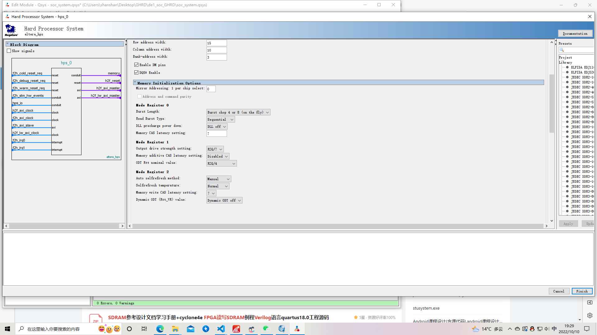
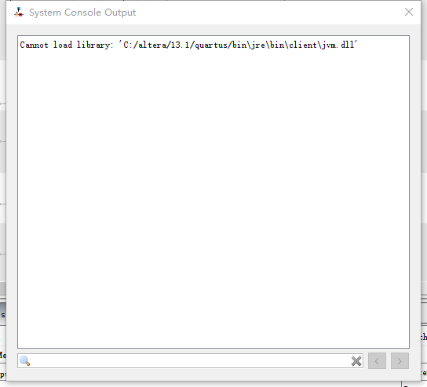

# SOC 与 SOPC
1. SOPC
   SOC FPGA之前的产品，软核ARM处理器（FPGA制作的处理器，占用FPGA资源，主频较低，但是可以释放该资源）
主要资源是NIOS II + FPGA，通过Avalon MM 以及 Avalon ST总线进行通信
2. SOC

    同一个芯片集成了FPGA和高性能的硬件逻辑固化的处理器HPS（Hardware Processor System），不做他用，也不能释放该部分资源。Cyclone V 为SOC FPGA芯片，主频可达925Mhz
3. SOC开发套件

    Quartus Prime 17.1 【FPGA开发：需掌握新建文件、保存编译、分配引脚等基本操作】
    Platform Designer（原名叫Qsys）集成在Quartus 【重点掌握，为SOC FPGA添加外设（IP）、总线的连接、配置HPS各种参数、 DDR3 存储器参数配置等】
    SOC EDS （类似cmd）【只是一个终端】
    DS-5 AE（类似keil）【应用程序开发在这里进行】
    Modelsim（做FPGA仿真用）
    putty 串口下载工具

    Linux 驱动开发

4. GHRD工程

    

    

# GHRD