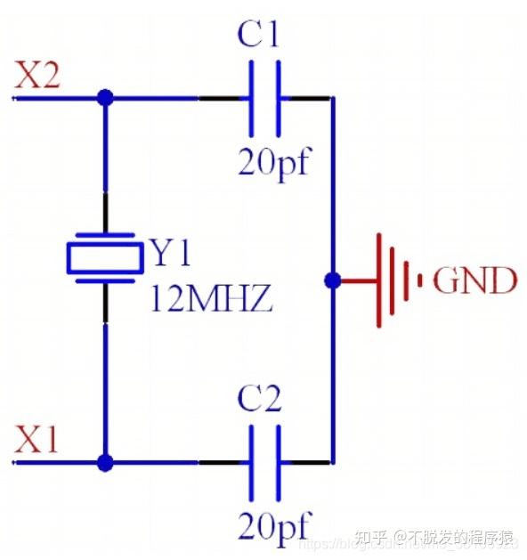
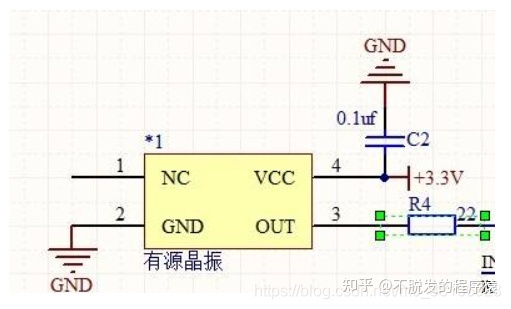

# Quick Start

# 晶振

1.1 无源晶振
无源晶振是有2个引脚的无极性元件，需要借助于时钟电路才能产生振荡信号，自身无法振荡起来。无源晶振信号质量较差，通常需要精确匹配外围电路（用于信号匹配的电容、电感、电阻等），更换不同频率的晶体时周边配置电路也需要做相应的调整。一般建议采用精度较高的石英晶体，尽可能不要采用精度低的陶瓷晶体。

1.2 有源晶振
有源晶振有4个引脚，是一个完整的振荡器，其中除了石英晶体外，还有晶体管和阻容元件，因此体积较大，只需要电源，就可输出比较好的波形。有源晶振的封装有4个引脚，分别为VCC（电压）、GND（地）、OUT（时钟信号输出）、NC（空脚）。有源晶振不需要CPU的内部振荡器，信号稳定，质量较好，而且连接方式比较简单（主要做好电源滤波，通常使用一个电容和电感构成滤波网络，输出端用一个小阻值的电阻过滤信号即可），不需要复杂的配置电路。

1.3 二者区别

1、有源晶振比较贵，但是有源晶振自身就能震动。而无论是无源晶振，还是有源晶振，都有自身的优点和缺点所在，若考虑产品成本，建议可以选择无源晶振电路；若考虑产品性能，建议选择有源晶振电路，省时方便也能保证产品性能。

2、无源晶振最高精度为5ppm，而有源晶振的精度则可以达到0.1ppm。精度越高，频率稳定性也更好。有源晶振在稳定性上要胜过无源晶振，但也有自身小小的缺陷，有源晶振的信号电平是固定，所以需要选择好合适输出电平，灵活性较差。

3、有源晶振一般4个脚，一个电源，一个接地，一个信号输出端，一个NC（空脚）。有个点标记的为1脚，按逆时针（管脚向下）分别为2、3、4。

4、无源晶振有2个引脚，需要借助于外部的时钟电路(接到主IC内部的震荡电路)才能产生振荡信号，自身无法振荡。

