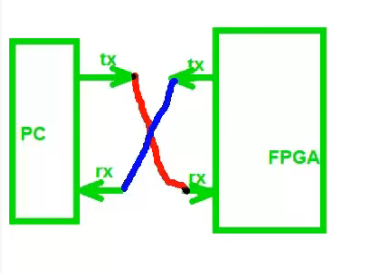
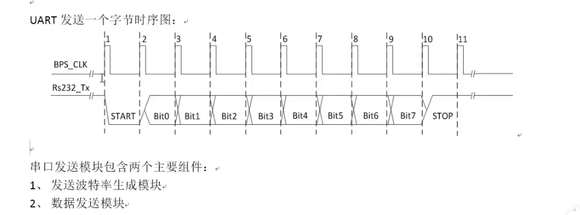
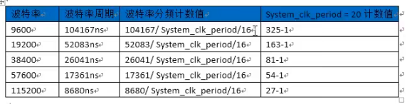
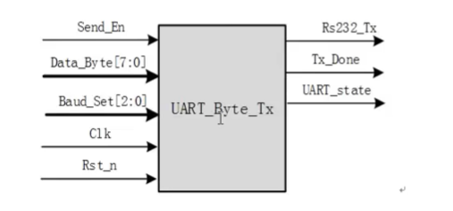
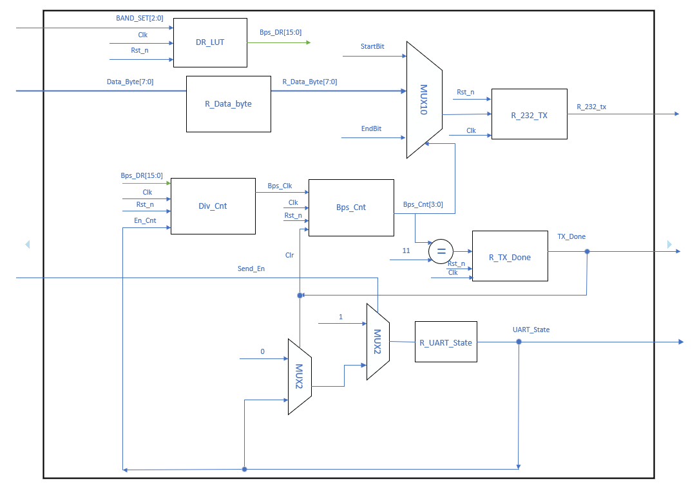
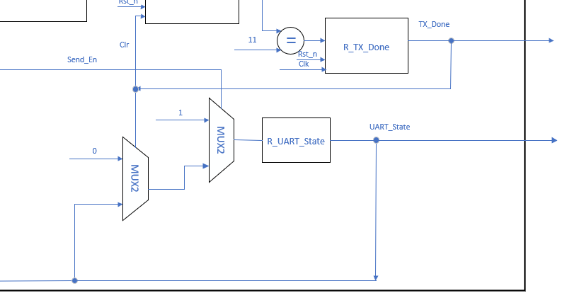
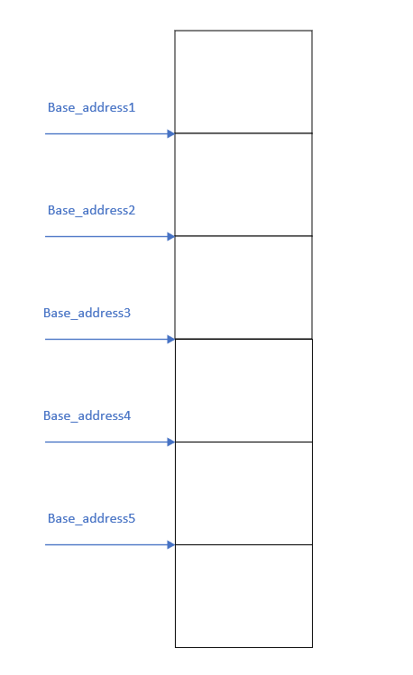
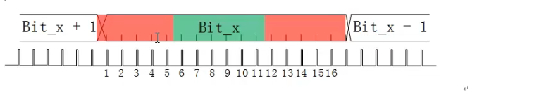
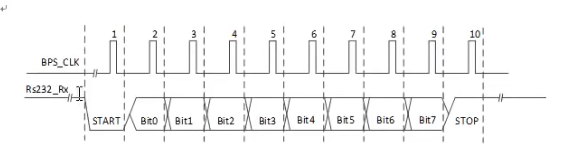
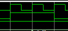

# 串口发送
## 串口发送图

## 串口发送时序图

## 波特率计数

## 串口模块

Send_En:发送使能信号
Data_Byte[7:0] : 发送数据流
Baud_set[2:0] : 波特率设置
Rs232_Tx ：一位发送数据流
Tx_Done : 发送完成标志
UART_state ：串口当前状态

## 串口工作原理
通过查询当前串口状态，若为发送状态，使能波特率发生计数器，该计数器从Bps_DR读取相应计数值，输出相应计数信号，计数信号每个时钟上深沿开启计数；计数内容如串口发送时序图所示，第一个时钟周期为发送开始字符，接下来依次发送八位数据，最后一位为发送停止字符，同时使能Tx_Done，Tx_Done信号送入自锁结构，用于指示串口状态UART_state。
### 串口原理图

### 自锁结构

注意send_en 和tx_done的顺序将会引起电路结构时序发生改变

Send_En 有效，UART_state <= 1;否则由Tx_Done判断，Tx_Done有效，UART_state <= 0，否则保持原状态。
``` verilog
//UART_State  judgment
always @(posedge Clk or negedge Rst_n) begin
    if (!Rst_n)
        UART_State <= 1'b0;
    else if (send_en)
        UART_State <= 1'b1;
    else
    begin
        if (Tx_Done)
            UART_State <= 1'b0;
        else
            UART_State <= UART_State;
    end
end
```

## 多字节串口发送方案
在顶层配置地址指针符号，通过查询基地址和偏移地址来开启特定位置的内容发送


# 串口接收
## 多次采样求均值
工业应用中，往往有非常强的电磁干扰，只进行一次采样就作为该电平的数据判断是不保险的，有可能恰好采集到被干扰的信号而出错，为此我们需要使用多次采样求概率的方式进行

采集16次，认为中间段6次绿色部分是可靠的，前面和后面红色部分都更容易受到外界干扰

例如6次结果中分别为1/1/1/1/0/1,认为该次电平结果为1，如果6次结果为0/0/0/0/0/1，认为该次电平结果为0，如果1，0结果各占一半，如0/1/0/0/1/1，则认为当前通信线路环境恶劣，数据结果不可靠。
## 数据接收时序


## 关于停止信号持续一周期的问题

如上，Rx_Done信号持续两周期，应将其改为持续一个时钟周期

