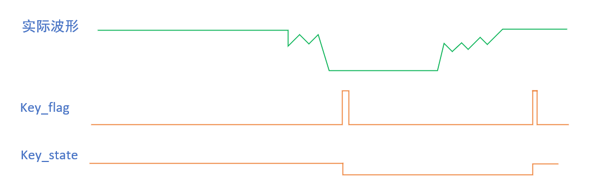
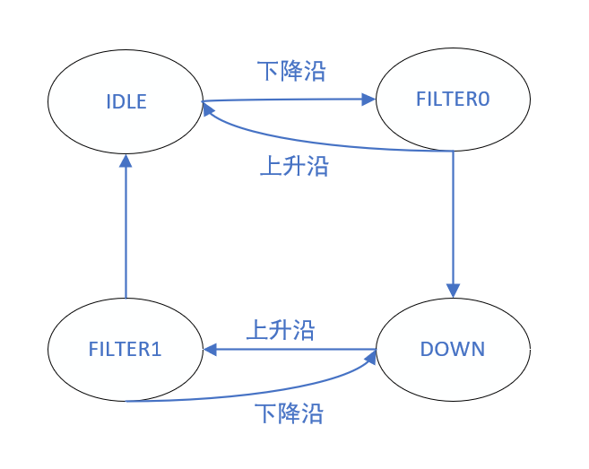
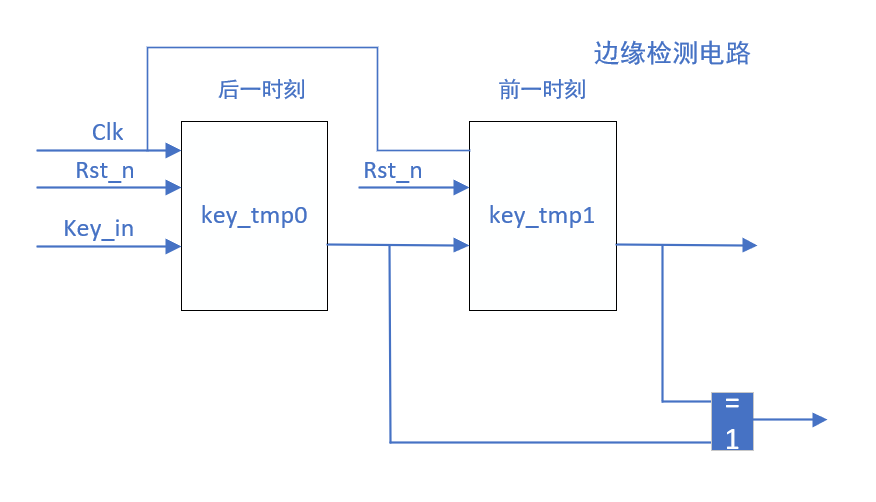
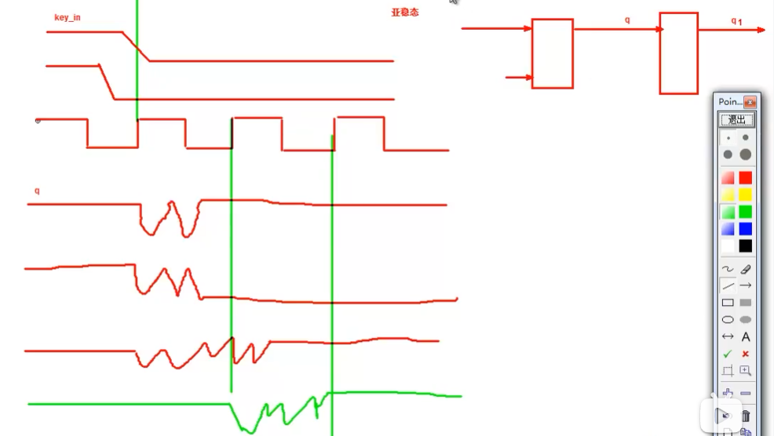
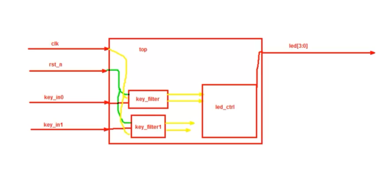
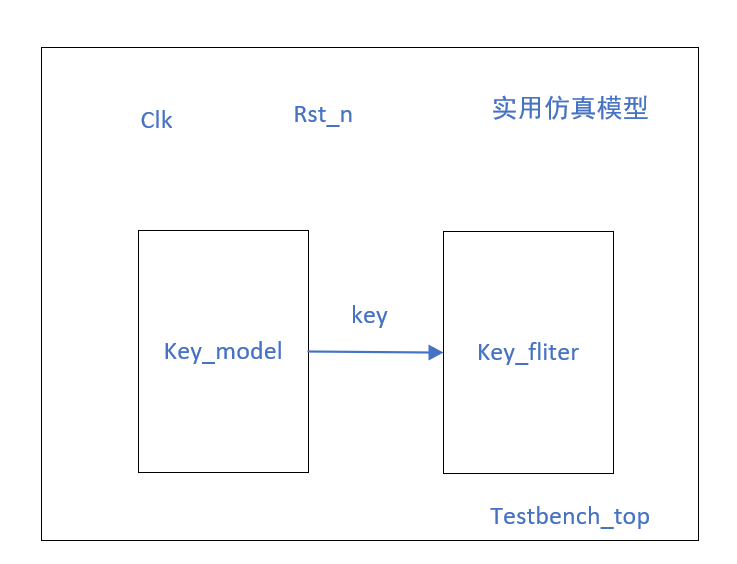
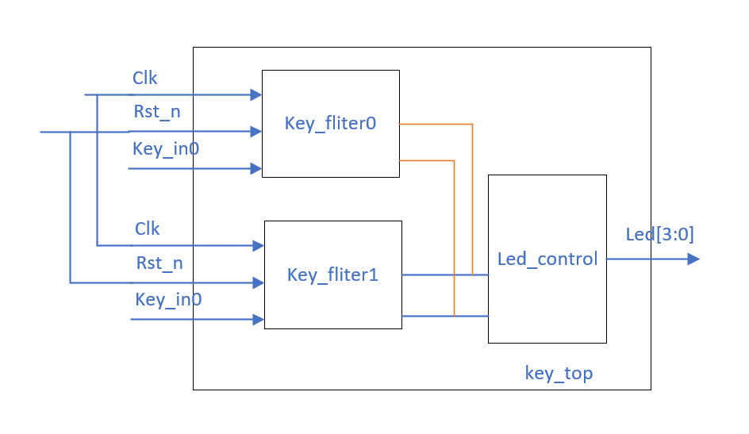
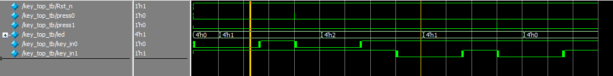

按位取反与逻辑取反
0110 ~ 1001
0110 ! 0000


# 按键消抖模块设计与验证
## 状态机设计
考虑引入四个状态进行设计
### 分析误差

利用一定延时来消除抖动产生的情况，在检测到抖动时延迟20ms
#### 延时计数器代码块
``` verilog
//delay counter
//20ms = 20_000_000
//cnt_full = 20ms/20ns = 1000_000-1 = 999_999 = F423F
always @(posedge Clk or negedge Rst_n) begin
    if (!Rst_n)
        delay_cnt <= 20'b0;
    else if (en_cnt == 1'b1)
        delay_cnt <= delay_cnt+1'b1;
    else
        delay_cnt <= 20'b0;
    
end


always @(posedge Clk or negedge Rst_n) begin
    if (!Rst_n)
        cnt_full <= 1'b0;
    else if (delay_cnt == 999_999)
        cnt_full <= 1'b1;
    else
        cnt_full <= 1'b0;
    
end
```
### 状态机设计

在检测到下降沿时转到滤波状态Fliter0，如果20ms过后还存在上升沿则表明还处于抖动状态，回到Idle，否则表明按键被按下，转到Down状态，在检测到上升沿时依次类推。
#### 边沿检测
使用前后两级寄存器寄存前后按键输入状态，用异或输出两级寄存器的值判断是否输入发生翻转

#### 状态机代码块
``` verilog
//state machine
always @(posedge Clk or negedge Rst_n) begin
    if (!Rst_n) begin
        key_state <= IDLE;
        en_cnt    <= 1'b0;
        key_flag  <= 1'b0;
        key_state <= 1'b1;
    end
    else begin
        case (state)
            IDLE :
            begin
                key_flag <= 1'b0;
                if (nedge)begin
                    state  <= Filter0;
                    en_cnt <= 1'b1;
                end
                else
                state <= IDLE;
            end
            
            Filter0 :
            if (cnt_full)begin
                key_flag  <= 1'b1;
                key_state <= 1'b0;
                state     <= Down;
                en_cnt    <= 1'b0;
            end
            else if (pedge)begin
                state  <= IDLE;
                en_cnt <= 1'b0;
            end
            else
            state <= Filter0;
            
            Down :
            begin
                key_flag <= 1'b0;
                if (pedge)begin
                    state  <= Filter1;
                    en_cnt <= 1'b1;
                end
                else
                state <= Down;
            end
            
            Filter1:
            if (cnt_full)begin
                key_flag  <= 1'b1;
                key_state <= 1'b1;
                state     <= IDLE;
                en_cnt    <= 1'b0;
            end
            else if (nedge)begin
                state  <= Down;
                en_cnt <= 1'b0;
            end
            else
            state <= Filter1;
            
            
            default:
            begin
                en_cnt    <= 1'b0;
                key_flag  <= 1'b0;
                key_state <= 1'b1;
                state     <= IDLE;
            end
        endcase
    end
end
```
## 亚稳态问题的引入

如图所示，当系统时钟上升沿时采集到亚稳态，D触发器将会将这种不稳定的状态寄存。根据寄存器的性能，亚稳态持续时间有可能在第二个时钟上升沿来到时还维持在这种状态。两级寄存器寄存输入信号的状态时比较稳妥的方案。
``` verilog
//同步时钟计数器
//两级寄存器解决亚稳态
reg key_in_s0,key_in_s1 ;
always @(posedge Clk or negedge Rst_n) begin
    if(!Rst_n)begin
        key_in_s0 <= 1'b0;
        key_in_s1 <= 1'b0;
    end
    else begin
        key_in_s0 <= key_in;
        key_in_s1 <= key_in_s0;
    end
end
```


## 测试模块
使用$random获取随机数,模拟按键随机抖动时间
``` verilog
`timescale 1ns/1ns

module key_module(
    press,
    key
);
    input press;
    output reg key;
    
    reg [15:0] myrand;

    initial begin
        key = 1'b1;
    end

    always @(posedge press) begin
        press_key;
		  #30000000;
		  release_key;
    end

    task press_key();
        begin
            repeat(50)
            begin
                myrand         = {$random}%65536;
                #myrand key = ~key;
            end
            key = 0;
            #20000000;
        end
    endtask
    
    task release_key();
        begin
            repeat(50)
            begin
                myrand         = {$random}%65536;
                #myrand key = ~key;
            end
            key = 1;
            #20000000;
        end
    endtask
    
endmodule

```

利用key_module获取仿真用按键输入信号，注意该设计思想
## 顶层模块与测试

如上，例化两个按键模块驱动4位led灯亮灭，实现按下按键1时led灯呈现加1计数，按下按键2时led亮灭呈现减1计数。
