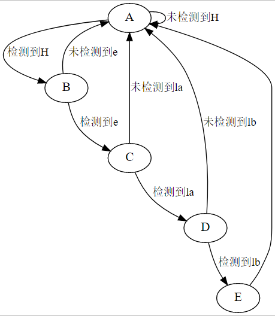
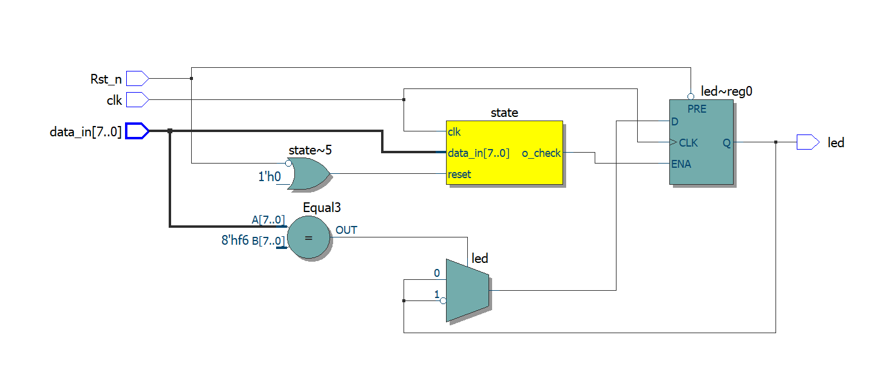
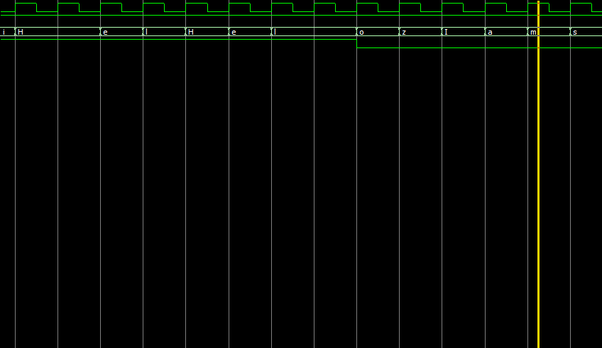

以"Hello"字符检测为例


# 状态转移图


一般状态机为了方便编码都是设置为二进制；但若状态转移是按顺序进行转移的话，我们可以使用格雷码，因为两相邻状态之间只变化1bit，这样可以节约功耗；若想提升速度，可以使用独热吗编码，因为每次仅需判断一位，这是用寄存器资源换组合逻辑资源，以达到更高的速度


以独热码方式进行编码，A、B、C、D、E代表检测'Hello'序列的五种状态
``` verilog
    localparam
    H_check  = 5'b0_0001,
    e_check  = 5'b0_0010,
    la_check = 5'b0_0100,
    lb_check = 5'b0_1000,
    o_check  = 5'b1_0000;
```

## 一段式状态机设计
### 一段式状态机
只有一个always block，把所有的逻辑（输入、输出、状态）都在一个always block的时序逻辑中实现。好处是写法简洁，输出由寄存器输出，无毛刺，坏处是该方式会产生多余的触发器，并且组合逻辑与时序逻辑混合，不利于综合优化，时序性能差。

### 电路图


### 代码部分
``` verilog
always @(posedge clk or negedge Rst_n) begin
        if (!Rst_n) begin
            state <= 5'd1;
			led <= 1'b1;
            
        end
        else begin
            case (state)
                H_check:
                if (data_in == "H")
                    state <= e_check;
                else
                    state <= H_check;
                e_check:
                if (data_in == "e")
                        state <= la_check;
                else
                        state <= H_check;
                la_check:
                if (data_in == "l")
                        state <= lb_check;
                else
                        state <= H_check;
                lb_check:
                if (data_in == "l")
                        state <= o_check;
                else
                        state <= H_check;
                o_check:
                begin
                    state <= H_check;
                    if(data_in == "o")
                    led <= ~led;
                    else
                    led <= led;
                end
                default:state <= H_check;
            endcase
            
        end
    end 
``` 
### 功能仿真部分


当检测到'Hello'序列时led状态翻转


## 两段式状态机
### 两段式
一个always块采用同步时序逻辑描述状态转移，另外一个always块采用组合逻辑判断状态转移条件，描述状态转移规律。