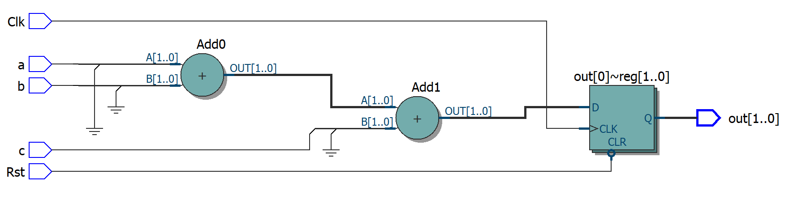
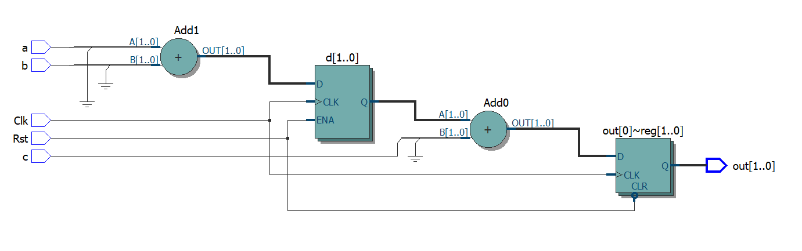
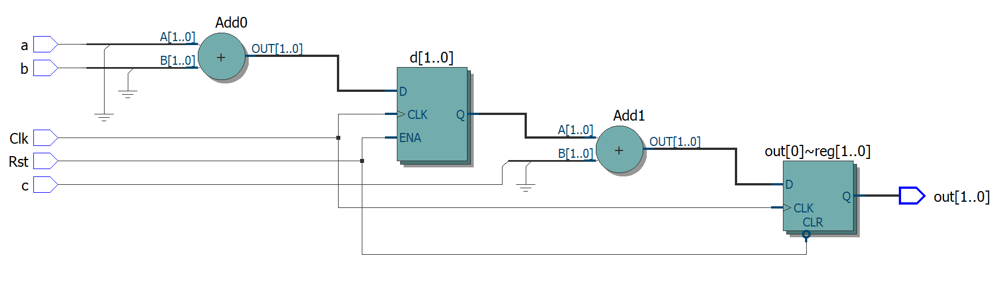

<center>
    
    <br>
    <div style="color:orange; border-bottom: 1px solid #d9d9d9;
    display: inline-block;
    color: #999;
    padding: 2px;">图一</div>
</center>

``` verilog
module block_nonblock (Clk,Rst,a,b,c,out
    
);

input Clk;
input Rst;
input a,b,c;
output reg [1:0]out;
reg[1:0]d;
always @(negedge Rst or posedge Clk ) begin
    if (!Rst) begin
        out = 2'b0;
    end
    else
    begin
        d = a+b;
        out = d+c;
    end

end
    
endmodule
```


更换代码顺序

``` verilog
    begin
        out = d+c;
        d = a+b;
    end
```

<center>
    
    <br>
    <div style="color:orange; border-bottom: 1px solid #d9d9d9;
    display: inline-block;
    color: #999;
    padding: 2px;">图二</div>
</center>

非阻塞赋值
``` verilog
    begin
        out <= d+c;
        d <= a+b;
    end
```

<center>
    
    <br>
    <div style="color:orange; border-bottom: 1px solid #d9d9d9;
    display: inline-block;
    color: #999;
    padding: 2px;">图三</div>
</center>
``` verilog
    begin
        d <= a+b;
        out <= d+c;
    end
```


<center>
    
    <br>
    <div style="color:orange; border-bottom: 1px solid #d9d9d9;
    display: inline-block;
    color: #999;
    padding: 2px;">图四</div>
</center>


可以看见图二三四电路结构是一致的


阻塞赋值：前面语句执行完，才可执行下一条语句；即：前面语句的执行（b=a）阻塞了后面语句的执行（c=b）。即：always块内，2条语句顺序执行。


非阻塞赋值：always块内，2条语句同时执行。即：前面语句的执行（b=a）不会阻塞后面语句的执行（c=b）。


最终信号输出出现延迟。