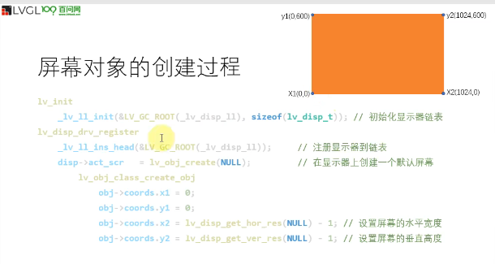
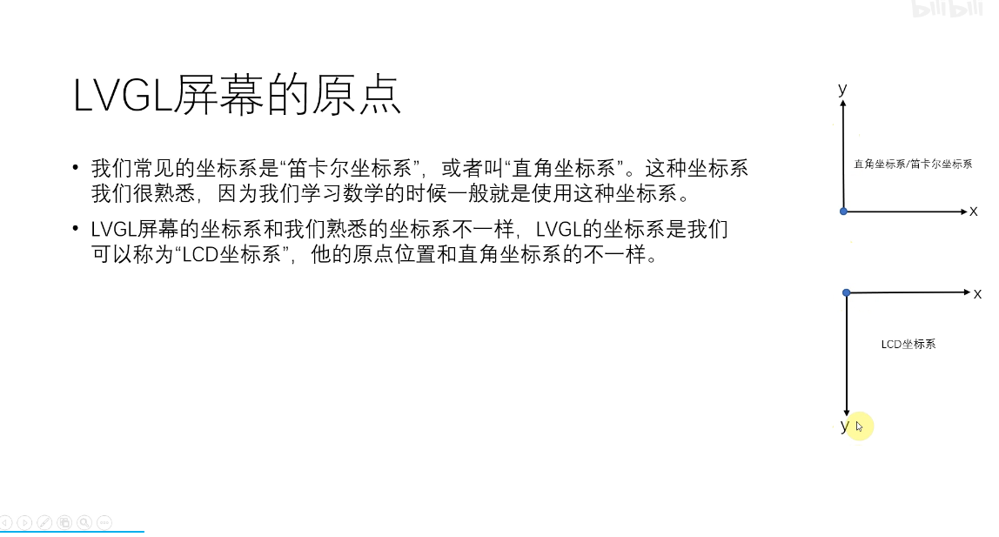
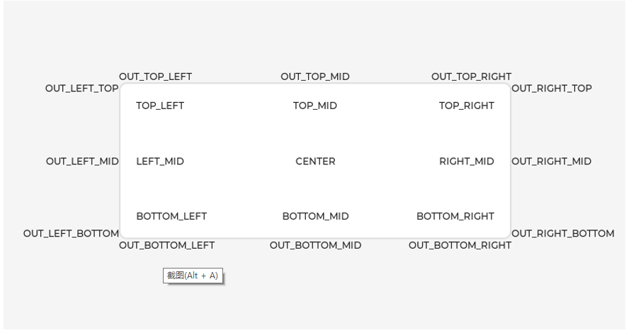

#### 基础对象

``` C
static lv_disp_t * disp_def;
```

#### 屏幕对象的创建



#### 屏幕对象的大小
``` C
 lv_obj_set_width(obj, 300);
lv_obj_set_height(obj, 500); 
lv_obj_set_size(obj,300, 300);
```
#### 屏幕对象的位置



``` C
// 指定x轴坐标位置
lv_obj_set_x(obj, 200);
//指定y轴坐标位置
lv_obj_set_y(obj, -50);、
//同时设置x、y坐标位置
lv_obj_set_pos(obj, 1300, 600);
//设置屏幕正中心位置
lv_obj_set_align(obj, LV_ALIGN_CENTER);
//以相对正中心位置为偏移量
lv_obj_align(obj, LV_ALIGN_CENTER, 100, 100);

//无父对象对齐方式（没有父子关系）
//label对象将会相当于obj的（0，0）偏移也就是位于正中心
lv_obj_t * label = lv_label_create(lv_scr_act());
lv_label_set_text(label, "Hello, LVGL!");
lv_obj_align_to(label, obj, LV_ALIGN_OUT_BOTTOM_MID, 0, 0);

```
一些关键字使用
