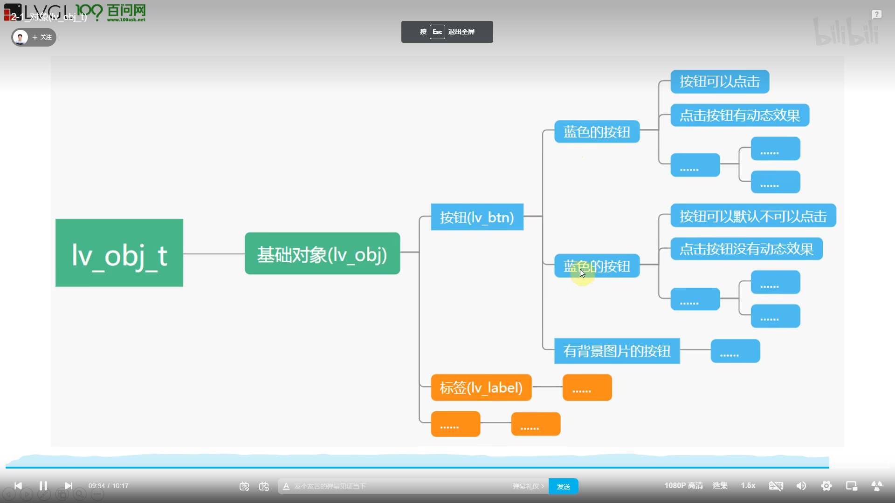

#### 基础对象

``` C
static lv_disp_t * disp_def;
```

#### 屏幕对象的创建


#### 屏幕对象的大小
``` C
 lv_obj_set_width(obj, 300);
lv_obj_set_height(obj, 500); 
lv_obj_set_size(obj,300, 300);
```
#### 屏幕对象的位置


``` C
// 指定x轴坐标位置
lv_obj_set_x(obj, 200);
//指定y轴坐标位置
lv_obj_set_y(obj, -50);、
//同时设置x、y坐标位置
lv_obj_set_pos(obj, 1300, 600);
//设置屏幕正中心位置
lv_obj_set_align(obj, LV_ALIGN_CENTER);
//以相对正中心位置为偏移量
lv_obj_align(obj, LV_ALIGN_CENTER, 100, 100);

//无父对象对齐方式（没有父子关系）
//label对象将会相当于obj的（0，0）偏移也就是位于正中心
lv_obj_t * label = lv_label_create(lv_scr_act());
lv_label_set_text(label, "Hello, LVGL!");
lv_obj_align_to(label, obj, LV_ALIGN_OUT_BOTTOM_MID, 0, 0);

```
一些关键字使用


#### 基础对象的盒子模型


LVGL 遵循 CSS 的 border-box 模型。 对象的“盒子”由以下部分构成：
**边界(bounding)**：元素的宽度/高度围起来的区域(整个盒子)。
**边框(border)**：边框有大小和颜色等属性(相当于盒子的厚度和它的颜色)。
**填充(padding**)：对象两侧与其子对象之间的空间(盒子的填充物)。
**内容(content)**：如果边界框按边框宽度和填充的大小缩小，则显示其大小的内容区域(盒子实际装东西的区域)。
**轮廓(outline)** ：LVGL中没有外边距(margin)的概念(盒子之间的距离)，确认代之的是轮廓(outline)。它是绘制于元素(盒子)周围的一条线，**它不占据空间，位于边框边缘的外围，可起到突出元素(盒子)的作用**。在浏览器里，当鼠标点击或使用Tab键让一个选项或者一个图片获得焦点的时候，这个元素就会多了一个轮廓框围绕。轮廓(outline) 。


LVGL的盒子模型是我们理解对象(部件)的组成，修改对象的样式，实现对对象的布局、处理对象排列等等的关键。


#### 基础对象的样式（styles）

样式：用名称保存下来的对修饰对象进行修饰所使用的一组**修饰参数**。
0. **Overview**
样式是一个 **lv_style_t** 变量，它可以保存边框宽度、文本颜色等属性。
将样式(变量)分配给对象就可以改变其外观。在赋值过程中，可以指定目标部分和目标状态。
一个样式可以给多个对象使用（正常样式）。
样式可以级联，也就是可以将多个样式分配给一个对象。所以，我们不用将所有属性都在一个样式中指定，可以通过多个样式组合的形式指定。 LVGL 会优先使用我们定义的样式，如果没有就会使用默认值。
后来添加的样式具有更高的优先级。也就是说如果在两种样式中指定了同一个属性，则将使用最后添加的样式。
**如果对象中未指定某些属性（例如文本颜色），就会从父级继承。**
上面说的是 “正常” 样式，对象还有本地样式，它比 “正常” 样式具有更高的优先级。
可以定义有过渡效果的样式。
默认有一个样式主题，我们也可以自己定义样式主题，作为默认的样式主题使用。


1. 声明变量并进行初始化
样式存储在 lv_style_t 变量中。样式变量应该是 静态 、全局或动态分配 的。 也就是它们不能是函数中的局部变量，因为当函数结束时它们会被销毁。样式初始化示例：
``` C
	static lv_style_t style_obj;
	lv_style_init(&style_obj);
``` 

2. 分配样式属性
当我们初始化好一个样式之后就可以设置它的样式属性了，接口函数是这样的格式：

``` C
    lv_style_set_<property_name>(&style, <value>);

    lv_style_set_bg_color(&style_obj, lv_color_hex(0x000000));   
    // 设置背景色
    lv_style_set_bg_opa(&style_obj, LV_OPA_50);	                    
    // 设置背景透明度	
    lv_style_set_....

```
3. 关联样式属性
当我们初始化并且设置好一个样式之后就可以将它添加到对象上面了，接口函数只有一个:
``` C
lv_obj_add_style(obj, &style, <selector>)
``` 


参数 “obj” 就是要添加到的对象，“style” 是指向样式变量的指针，<selector> 是应添加样式的部分和状态的 OR-ed 值 (不能是互斥，否则就是清除标志，没法合并)。示例：
``` C
lv_obj_add_style(obj, &style_obj, 0);  // 默认(常用)
lv_obj_add_style(obj, &style_obj, LV_STATE_PRESSED); 
 // 在对象被按下时应用样式
``` 

4. 查看样式属性

英文原版：https://docs.lvgl.io/8.1/overview/style-props.html
中文翻译：http://lvgl.100ask.net/8.1/overview/style-props.html

5. 样式的状态和部分

常用的状态
``` C
LV_STATE_DEFAULT (0x0000) //正常，释放状态
LV_STATE_CHECKED (0x0001) //切换或检查状态
LV_STATE_FOCUSED (0x0002) //通过键盘或编码器聚焦或通过触摸板/鼠标点击
LV_STATE_FOCUS_KEY (0x0004) //通过键盘或编码器聚焦，但不通过触摸板/鼠标聚焦
LV_STATE_EDITED (0x0008) //由编码器编辑
LV_STATE_HOVERED (0x0010) //鼠标悬停（现在不支持）
LV_STATE_PRESSED (0x0020) //被按下
LV_STATE_SCROLLED (0x0040) //正在滚动
LV_STATE_DISABLED (0x0080) //禁用状态
LV_STATE_USER_1 (0x1000) //自定义状态
LV_STATE_USER_2 (0x2000) //自定义状态
LV_STATE_USER_3 (0x4000) //自定义状态
LV_STATE_USER_4 (0x8000) //自定义状态
``` 

对象可以有 部分(parts) ，它们也可以有自己的样式。LVGL 中存在以下预定义部分

``` C
LV_PART_MAIN  //类似矩形的背景
LV_PART_SCROLLBAR  //滚动条
LV_PART_INDICATOR  //指标，例如用于滑块、条、开关或复选框的勾选框
LV_PART_KNOB  //像手柄一样可以抓取调整值
LV_PART_SELECTED  //表示当前选择的选项或部分
LV_PART_ITEMS  //如果小部件具有多个相似元素（例如表格单元格）
LV_PART_TICKS  //刻度上的刻度，例如对于图表或仪表
LV_PART_CURSOR  //标记一个特定的地方，例如文本区域或图表的光标
LV_PART_CUSTOM_FIRST //可以从这里添加自定义部件。
``` 
#### 基础对象的事件

1. 添加事件
``` C
lv_obj_add_event_cb(obj, event_cb, event_code, user_data);
```

2. 回调函数的参数
事件回调函数只有一个参数，这个参数对我们的作为非常大，现在的版本提供这些功能：
	``static void my_event_cb(lv_event_t * event);``
获取触发的事件代码：	
``lv_event_code_t code = lv_event_get_code(e);``
获取触发事件的对象：	
``lv_obj_t * target = lv_event_get_target(e);``
获取最初触发事件的对象(事件冒泡)：
 ``lv_obj_t * target = lv_event_get_current_target(e);``
获取事件传递的用户数据：	
``lv_event_get_user_data(e); ``获取使用 ``lv_obj_add_event_cb`` 传递的用户数据``lv_event_get_param(e);`` 获取使用 ``lv_event_send`` 传递的用户数据

3.事件冒泡

如果对象启用了
`` lv_obj_add_flag(obj, LV_OBJ_FLAG_EVENT_BUBBLE)``
该对象的所有事件将会发送到该对象的父级
如果父级也启用了 LV_OBJ_FLAG_EVENT_BUBBLE，那么事件继续发送到他的父级，依此类推.
``lv_event_get_target(e);`` 获取触发事件的当前对象。
``lv_event_get_current_target(e); ``获取事件冒泡的父对象


