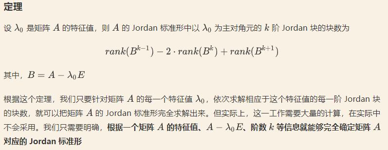
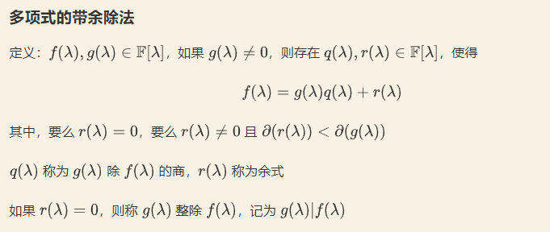
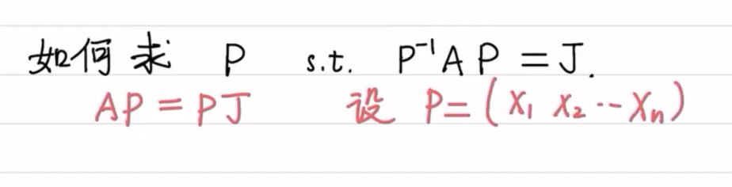
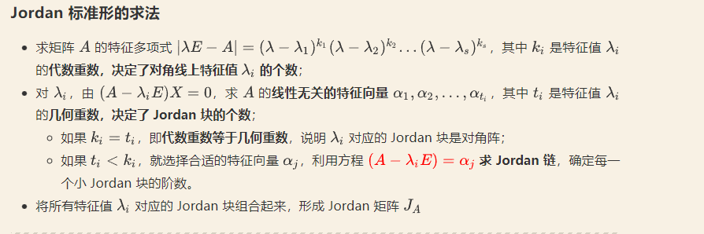
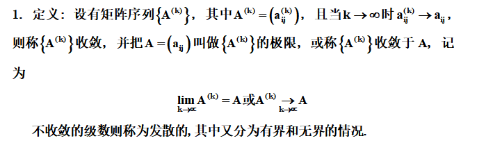
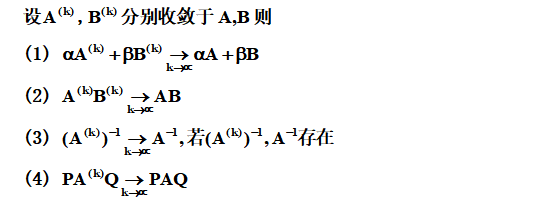
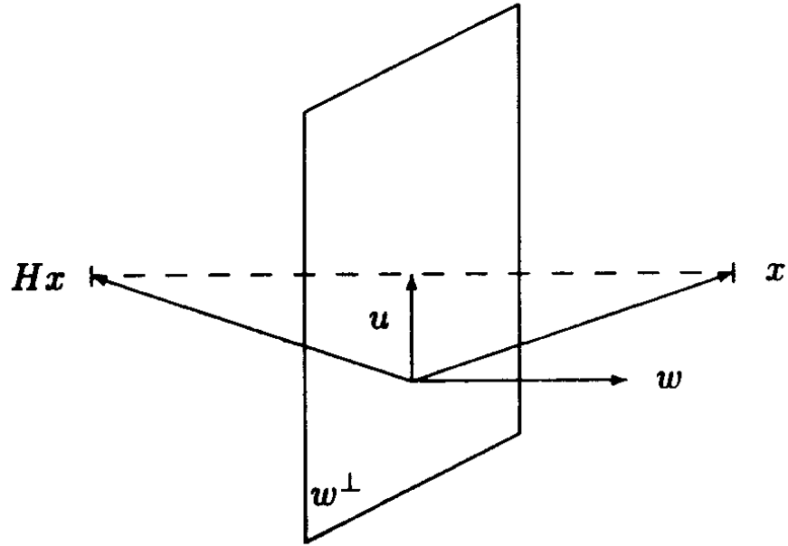

## 线性变换运算 

1. 零变换
   把线性空间中的任一向量都变为零向量的变换也是一个线性变换,称为零变换,记为$T_0$,于是有
$$T_0x=0 $$

2. 线性变换与数的乘法
   设$k\in K$,$T$为线性空间$V$中的线性变换,定义数$k$与$T$ 的乘积$kT$为
   $$(kT)x=k(Tx)$$

3. 线性变换的乘法
    设$T_1$、$T_2$是线性空间$V$的两个线性变换,定义$T_1$、$T_2$的乘积$T_1$$T_2$为
    $$(T_1T_2)x=T_1(T_2x)$$

4. 逆变换
5. 线性变换的多项式

## 线性变换的矩阵表示

只要能够确定出$V$的基向量的象,则$V$中任一向量的象也就完全确定了
有矩阵A
$$
\begin{matrix}
a_1 & a_2 & a_3 \\
a_4 & a_5 & a_6 \\
a_7 & a_8 & a_9 
\end{matrix} \tag{1}
$$

对于$V^n$的一个线性变换可以确定一个$n$阶矩阵,反之.对于一个n阶矩阵$A$就能得到$n$个向量,可以证明,以这$n$个向量为基象组的线性变换$T$只有唯一的一个

### 确定一个线性变换
1. 利用定义可加性与数乘
2. 一个线性变换只有唯一一个矩阵与之对应

### 特征值与特征向量

定义1.16
$$Tx={\lambda_0}x$$
线性变换$T$的特征值${\lambda_0}$,特征向量为$x$。
由
$$T(kx)={\lambda_0}(kx)$$
可知：特征向量不是被特征值唯一确定，但是特征值却被特征向量唯一确定

### 矩阵的相似

若有可逆矩阵$P$，使得
$${P^{-1}}AP = B$$
则称A相似于B
相似矩阵迹相同，特征多项式相同，特征值也相同

定理1.17, 任意$n$阶矩阵与三角矩阵相似

**定理1.18:$n$阶矩阵是其特征多项式的矩阵根零点即令**
$$\varphi(\lambda) = det(\lambda I-A) = \lambda^n+a_1\lambda^{n-1}+ \cdots+a_{n-1}\lambda+a_n$$
则

$$\varphi(A) = A^n+a_1A^{n-1}+ \cdots+a_{n-1}A+A= 0$$ 

### 对角矩阵   

$n$阶矩阵可以相似对角化的条件是该矩阵有$n$个线性无关的特征向量（也被称为具有完备的特征向量系）

### Jordan标准型
Jordan 标准形的存在性、唯一性

若

$$J=\begin {bmatrix} J_1\\&J_2\\&&\ddots\\&&&J_s\end {bmatrix}$$
是矩阵$A$的$Jordan$标准形,而
$$K=\begin {bmatrix} J_{i_1}\\&J_{i_2}\\&&\ddots \\&&&J_{i_s}\end {bmatrix}$$

其中$J_{i_1},J_{i_2},...,J_{i_s}
$是$J_1,J_2,...,J_s
$的一个排列，则$K$也是$A$的$Jordan$标准形

除了相差 $Jordan $块的次序外，矩阵的 $Jordan$ 标准形是存在的、唯一的

#### 性质
1.  $A$ ~ $J$,$\lambda_{0}$是数,则对一切正整数$k$

$$rank ((A-\lambda_0E)^k)=rank ((J-\lambda_0E)^k)
$$

2. $n\times n$ 矩阵$N=\begin {bmatrix} 0&1\\&0&\ddots\\&&\ddots&1\\&&&1\end {bmatrix}
$
则
$$rank (N^{k-1})-rank (N^k)=\begin {cases} 1, 若 k≤n\\0, 若 k>n\end {cases}$$

### Jordan 标准型求法
1. $Joedan$标准型
第一步 计算出$A$的特征值
第二步 计算出每个特征值对应的$Jordan$块数
$$
{numbers \quad of\quad J(\lambda_i)} = n-rank(\lambda I - A) 
$$
第三步 计算对应特征值$Jordan$块阶数(参考上文定理)

2. 求$P$

$$
A(X_1 ,X_2,X_3\dots X_n) = (X_1 ,X_2,X_3\dots X_n)J
$$
去求解上方程的解向量

3. 求矩阵最小多项式
   去求每个小分块的首一最小公倍式

### 两种特殊空间

1. 欧式空间

2. 酉空间

## 矩阵分析以及应用

### 矩阵级数与矩阵函数
1. 矩阵序列

2. 收敛矩阵的性质

### 解线性微分方程组

todo 不变因子对矩阵的含义

## 矩阵分解

1. QR分解
   
   1.1 Given矩阵以及Given变换

   1.2 Householder矩阵以及Householder变换

Hu=u,Hω=-ω。
