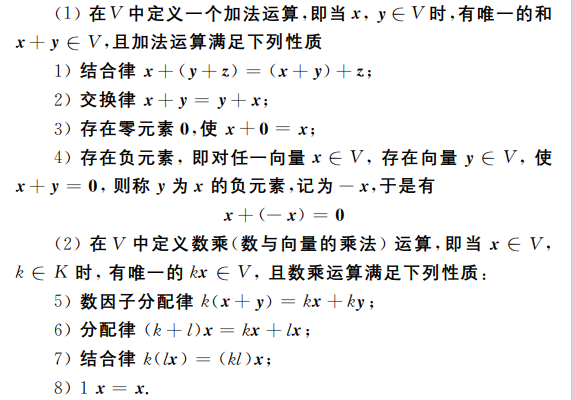
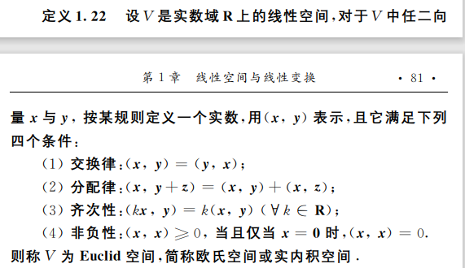
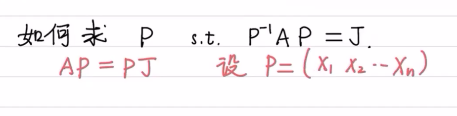
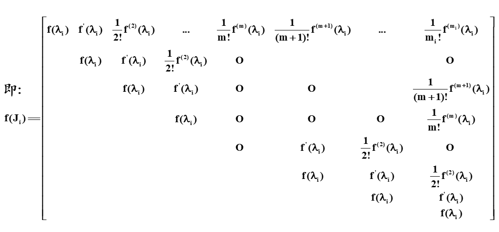
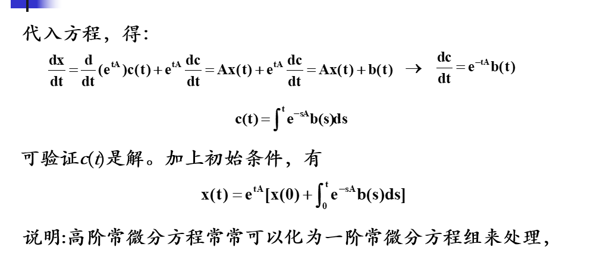
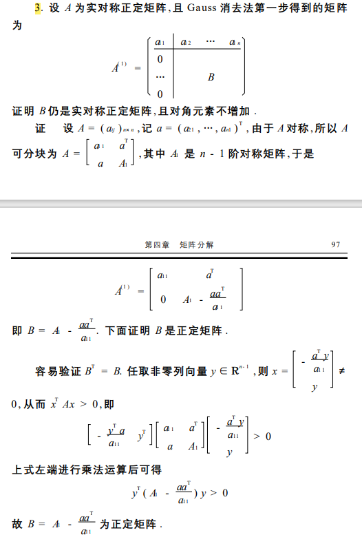
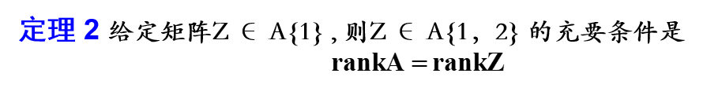
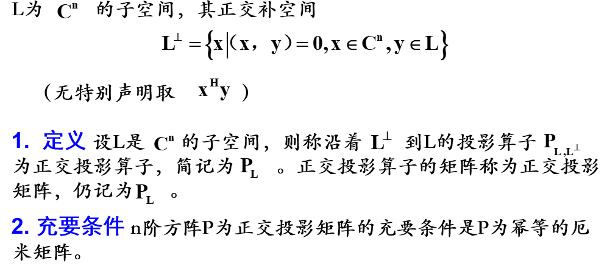
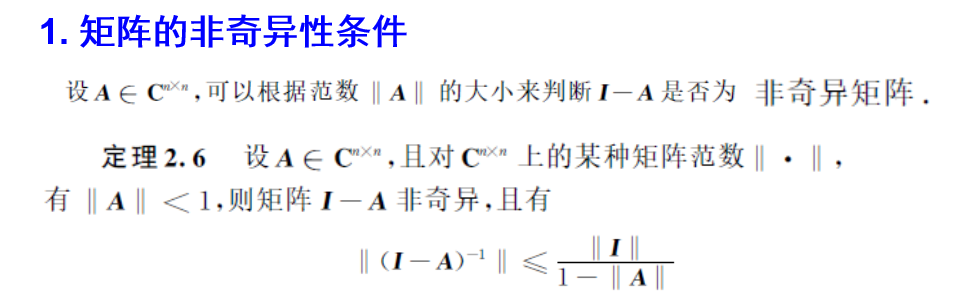

## 第一章
1. 线性空间
   * 判断集合所值运算是否构成线性空间
    首先需要证明两种运算的唯一性和封闭性
    再看是否满足八条性质
    

   * 两个 $m$ 次多项式相加不一定还是 $m $次多项
    式,所以加法运算不封闭,(请求举例说明) 

   * 求过渡矩阵与坐标变换
    
    过渡矩阵是非奇异矩阵  
    
    成为基的两个条件：
    (1) 它可以线性表示V1+V2中的任意元素
    (2) 线性无关

   * 求解子空间

2. 线性子空间
    * 线性子空间定义

    
   * 基扩定理
   * 子空间的交与和
    若$V_1$和$V_2$是线性空间$V$的两个子空间，则 ${V_1} \cap V_2$，$V1＋V2$均为V的子空间。
   * (维数公式)若$V_1$、$V_2$是线性空间V的子空间，则有
                     $$dim(V_1+V_2)+ dim(V_1 \cap V_2)= dimV_1+ dimV_2$$
    * 子空间的直和(看看第13题)

    等价表述
    （1） $V_1+V_2$成为直和
    （2）${V_1} \cap V_2 = {0}$
    （3） $dim(V_1+V_2)=dimV_1+ dimV_2$
 $（4） x_1、x_2、···、x_s为V_1的基，y_1、y_2、···、yt为V_2的基，则x_1、x_2、···、x_s、y_1、y_2、···、y_t为 V_1+ V_2的基$.

 3. 线性变换及其矩阵

    * 线性变换矩阵表示 （$T和A互相唯一确定$）
   
   注意到在进行乘法的时候，线性变换要注重整体
   
   * 线性变换的在基下面的坐标
   
   * 线性变换在不同的基下面的矩阵表示，注意与上面的区别
   * 线性变换及矩阵的值域和核
   
   
4. 矩阵的对角化
   
   * 任意 $n$ 阶方阵 $A$与三角矩阵相似
   * 内积空间
   * 欧式空间
   
   * 度量矩阵（对称矩阵且是正定矩阵）
   
   * 酉空间
   * 
   * 
   * 施密特正交
   * 

5. 对角化与Jordan标准型

   * 正规矩阵
    
    
   * Schur引理
    
    
    不能酉对角化可能能相似对角化
    实正规矩阵一般不能通过正交相似变换实对角化
    不变子空间
    $$定义：如果T是线性空间V上的线性变换，V1是V的子空间，并且对V1中任意的元素x，Tx仍在V1中，则称V1是T的不变子空间$$

* Jordan标准型矩阵求法
  1. $Joedan$标准型
   第一步 计算出$A$的特征值
   第二步 计算出每个特征值对应的$Jordan$块数
   $$
   {numbers \quad of\quad J(\lambda_i)} = n-rank(\lambda I - A) 
   $$
   第三步 计算对应特征值$Jordan$块阶数(参考上文定理)

  2. Jordon标准形变换矩阵P的求法
   求$P$
  
  $$
  A(X_1 ,X_2,X_3\dots X_n) = (X_1 ,X_2,X_3\dots X_n)J
  $$
  去求解上方程的解向量
   
   
  * Jordan标准型的幂及多项式
   
   

## 第三章 矩阵分析及其应用

1. 矩阵级数与矩阵函数

2. Neumann级数收敛的充要条件
 
3. 收敛圆
 
 注意
 
 矩阵微分注意没法交换乘法次序
 
 
4. 零化多项式
 多项式f(z),若f(A)=0,则称其为A的零化多项式。由以上定理可知，方阵A的特征多项式为A的零化多项式。
5. 利用Jordan标准型求矩阵函数
 求出Jordan标准型以及变换矩阵P，利用Jordan标准型的幂求解
 定律 n阶方阵A的最小多项式等于它的特征矩阵的第n个（也就是最后一个）不变因子。
 

6. 矩阵微分方程
7. 求解一阶线性齐次常系数微分方程
 
8. 求解一阶线性非齐次常系数微分方程
 

## 第四章 矩阵分解
* Gauss消元法的矩阵形式
 
 
 
 

* LU分解与LDU分解
 
 n阶非奇异矩阵A有三角分解LU或LDU的充要条件是A的顺序主子式       （r=1,2,…,n）（在高斯消元的基础上推导而来的）
* 主元素法
* 其他三角分解
 
 注意一下该三角分解两边矩阵关系
* 矩阵的QR分解
* Givens矩阵与Givens变换
 
 
* Givens矩阵的性质
 
 
 
* Householder矩阵
 
 
 
* QR分解
 
 
 求QR矩阵的方法（三种方法旋转矩阵分解，对称矩阵分解，施密斯正交分解）
* 满秩分解
 
* 存在性定理 任何非零矩阵均存在满秩分解
 
 
* 酉对角分解与奇异值分解
 
 

## 广义逆矩阵
* Penrose 广义逆矩阵的定义及存在性
 
 
* $\{1\}逆的性质$
 $对于元素全为1的n阶矩阵J有$
 $$J^2 = nJ$$
 
 
 
 
 
 
 
* 投影与投影矩阵
* 矩阵为投影矩阵的充要条件为矩阵是幂等矩阵
 
* 幂等矩阵重要性质
  $幂等矩阵的投影矩阵的零空间等于I-A的投影矩阵的值域$
 
 
 $该定理表明n阶幂等矩阵和n阶投影矩阵是一一对应的$
* 投影矩阵的构造
 
 
 
* 正交投影的构造
* 广义逆的计算与应用
* 由Hermite标准型求$\{1\}逆$
* hermite几阶就选几阶单位矩阵
 
 
 
 
* 由满秩分解求广义逆
 
 
 
 
 
 
* 矛盾方程组的解
* 
* 
 

 
 
* 法向回归
* 法向回归与最小二乘法区别
 
* 全面最小二乘法
 
* 向量范数
* 范数可以看作长度概念的推广，主要用于逼近的程度
 
* 几类范数
 
 
 
 
 
* 上述用于证明（判断）矩阵范数
 
 
* 常用的矩阵范数
 

* 矩阵的非奇异体条件
 
* 矩阵的谱半径以及性质
 
* 特征值界的估计
 
 
 
 
* 盖尔圆
 
 
 
 
* 矩阵特征值的隔离

 
* 广义特征值问题
 
* 瑞利商
 

