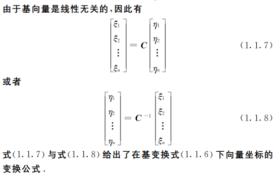

## 第一章
1. 线性空间
   * 判断集合所值运算是否构成线性空间
    首先需要证明两种运算的唯一性和封闭性
    再看是否满足八条性质
    

   * 两个 $m$ 次多项式相加不一定还是 $m $次多项
    式,所以加法运算不封闭,(请求举例说明) 

   * 求过渡矩阵与坐标变换
    
    过渡矩阵是非奇异矩阵  
    
    成为基的两个条件：
    (1) 它可以线性表示V1+V2中的任意元素
    (2) 线性无关

   * 求解子空间

2. 线性子空间
    * 线性子空间定义

    
   * 基扩定理
   * 子空间的交与和
    若$V_1$和$V_2$是线性空间$V$的两个子空间，则 ${V_1} \cap V_2$，$V1＋V2$均为V的子空间。
   * (维数公式)若$V_1$、$V_2$是线性空间V的子空间，则有
                     $$dim(V_1+V_2)+ dim(V_1 \cap V_2)= dimV_1+ dimV_2$$
    * 子空间的直和(看看第13题)

    等价表述
    （1） $V_1+V_2$成为直和
    （2）${V_1} \cap V_2 = {0}$
    （3） $dim(V_1+V_2)=dimV_1+ dimV_2$
 $（4） x_1、x_2、···、x_s为V_1的基，y_1、y_2、···、yt为V_2的基，则x_1、x_2、···、x_s、y_1、y_2、···、y_t为 V_1+ V_2的基$.

 3. 线性变换及其矩阵

