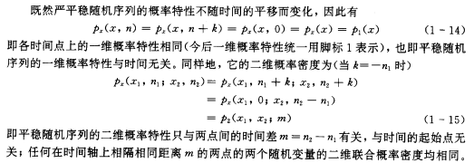
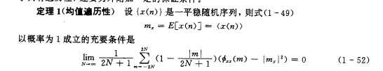
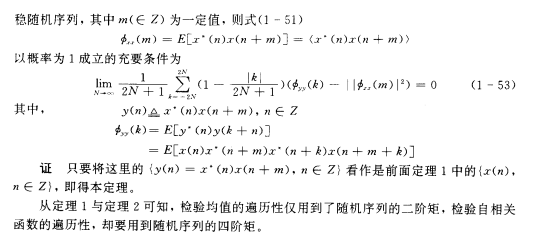
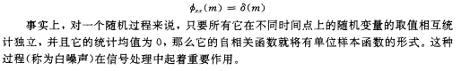
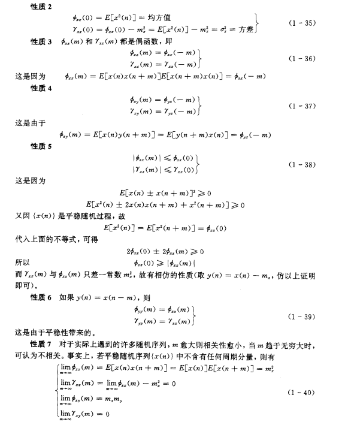
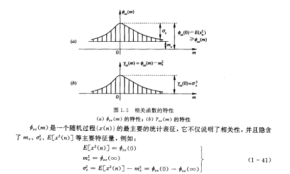
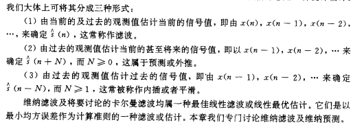

# 第一章 
1.  平稳随机信号的判断

    均值为常数，自相关函数只与两点时间差有关
    
2.  各态历经信号判断 （与平稳随机信号关系）
   
   
3.  白噪声信号的相关函数 功率谱（时域频域有什么特点）

    
4.  自（互）相关函数物理意义、性质（判断一个表达式能否作为相关函数）

    考虑使用自（互）相关函数的性质作为参考
    * 性质1 当${m_x = 0}$时，相关序列和协方差序列相等
    * 
    * 

5.  自相关矩阵的性质（对称、正定？）判断一个矩阵能否作为自相关矩阵

6.  功率谱密度性质（判断一个表达式能否作为功率谱密度）
7.  功率谱和自相关有什么关系

    是一对唯一确定的傅里叶变换对
8.  周期图的概念
9.  随机信号通过线性时不变系统的响应
10.  知道输入统计特性，过线性系统能求出输出统计特性
11.  能量有限信号的自相关概念
12.  相关卷积定理（去做一些证明题）
# 第二章
1. 三个问题区别（滤波 预测 插值）重点在滤波

   
2. 维纳霍夫方程（矩阵形式也需要掌握）2-23 2-27 理解会用
3. 白化一个随机信号 （计算白化滤波器） 谱因式分解 一个表达式写成三个东西相乘
4. 非因果的维纳滤波器
5. 因果维纳滤波器 （37例题 知道怎么计算）
6. 维纳预测器N步纯预测 （公式79）（43页例题）
7. 一步线性预测 （）91页
# 卡尔曼滤波
1. 什么是新息？
2. 观测方程 动态方程
3. 8，9，20（反映卡尔曼滤波基本思想）
4. 3.1例题好好看 （最简单的计算题必拿下）
5. 卡尔曼滤波与维纳滤波比较
# 自适应滤波
1. 自适应滤波器的基本特点（）
2. 三个算法 最速下降 LMS 递推最小二乘
3. 最速下降（迭代公式） 收敛速度和谁有关 步长参数收敛速度稳定性有什么关系
4. LMS 列出题中迭代公式 u的取值范围怎么选择 对失调量和收敛速度有什么影响
5. 递推最小二乘 与LMS的区别 什么是遗忘因子
6. 三个算法相同点与不同点
7. 自适应噪声比较器 原理分析与应用 （满足条件）
8. 不同场合下的自适应滤波实现框图
# 功率谱估计
1. 谱估计
2. 一致估计
3. 评价估计的好坏
4. 估计自相关的时候 有哪两种方法 各自优缺点
5. BT法 周期图法 各自优缺点
6. 如何降低周期图法方差
7. AR模型 方程5-70一定会
8. AR模型与线性预测关系
9. AR模型与最大商谱估计
10. AR模型与LD递推算法（反射系数）
11. AR模型阶次有什么特点
12. AR模型与周期图法
13. 最大商谱估计基本思想
14. 最小方差法基本思想

判断题 计算题 简述题 证明题